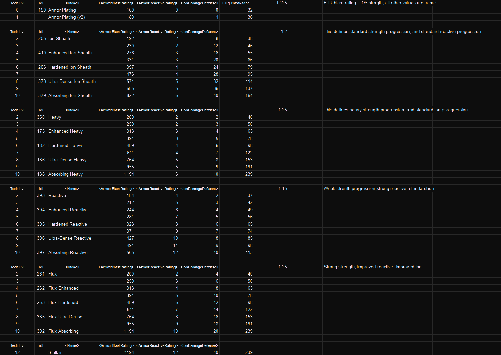

# Distant Worlds 2 - XL

## Authors and Contributors
- Mordachai: Principle author
- Rah: Stellar Hangar Bays mod
- Baronfuming, Mordachai, ChatGPT: Extended Ship Design Names mod
- SharkMolester: HyperDrive Diversity mod

## Table of Contents
- [Distant Worlds 2 - XL](#distant-worlds-2---xl)
  - [Authors and Contributors](#authors-and-contributors)
  - [Table of Contents](#table-of-contents)
  - [Guiding Principles](#guiding-principles)
  - [Mod Highlights](#mod-highlights)
  - [Latest Changes](#latest-changes)
    - [v1.19.5](#v1195)
    - [v1.19.4](#v1194)
    - [v1.19.3](#v1193)
    - [v1.19.2](#v1192)
    - [v1.19.1](#v1191)
    - [1.19.0-Hotfix](#1190-hotfix)
    - [v1.19.0](#v1190)
    - [v1.18.16](#v11816)
    - [v1.18.15](#v11815)
    - [v1.18.14](#v11814)
    - [v1.18.13](#v11813)
    - [v1.18.12](#v11812)
    - [v1.18.11](#v11811)
    - [v1.18.10](#v11810)
    - [v1.18.9](#v1189)
    - [v1.18.8](#v1188)
    - [v1.18.7](#v1187)
    - [v1.18.6](#v1186)
    - [v1.18.5](#v1185)
    - [v1.18.4](#v1184)
    - [v1.18.3](#v1183)
    - [v1.18.2](#v1182)
    - [v1.18.1](#v1181)
    - [v1.18.0](#v1180)
    - [v1.17.5](#v1175)
    - [v1.17.4](#v1174)
    - [v1.17.3](#v1173)
    - [v1.17.2](#v1172)
    - [v1.17.1](#v1171)
    - [v1.17.0](#v1170)
    - [v1.16.9](#v1169)
    - [v1.16.8](#v1168)
    - [v1.16.7](#v1167)
    - [v1.16.6](#v1166)
    - [v1.16.5](#v1165)
    - [v1.16.4](#v1164)
    - [v1.16.3](#v1163)
    - [v1.16.2](#v1162)
    - [v1.16.1](#v1161)
    - [v1.16.0](#v1160)
    - [v1.15.5](#v1155)
    - [v1.15.4](#v1154)
    - [v1.15.3](#v1153)
    - [v1.15.2](#v1152)
    - [v1.15.1](#v1151)
    - [v1.15.0](#v1150)
    - [v1.14.5](#v1145)
    - [v1.14.4](#v1144)
    - [v1.14.3](#v1143)
    - [v1.14.2](#v1142)
    - [v1.14.1](#v1141)
    - [v1.14.0](#v1140)
    - [v1.13.6](#v1136)
    - [v1.13.5](#v1135)
    - [v1.13.4](#v1134)
    - [v1.13.3](#v1133)
    - [v1.13.2](#v1132)
    - [v1.13.1](#v1131)
    - [v1.13.0](#v1130)
    - [v1.12.0](#v1120)
    - [v1.11.9](#v1119)
    - [v1.11.8](#v1118)
    - [v1.11.7](#v1117)
    - [v1.11.6](#v1116)
    - [v1.11.5](#v1115)
    - [v1.11.4](#v1114)
    - [v1.11.3](#v1113)
    - [v1.11.2](#v1112)
    - [v1.11.1](#v1111)
    - [v1.11.0](#v1110)
    - [v1.10.5](#v1105)
    - [v1.10.4](#v1104)
    - [v1.10.3](#v1103)
    - [v1.10.2](#v1102)
    - [v1.10.1](#v1101)
    - [v1.10.0](#v1100)
    - [v1.9.9](#v199)
    - [v1.9.8](#v198)
    - [v1.9.7](#v197)
    - [v1.9.6](#v196)
    - [v1.9.5](#v195)
    - [v1.9.4](#v194)
    - [v1.9.3](#v193)
    - [v1.9.2](#v192)
    - [v1.9.1](#v191)
    - [v1.9.0](#v190)
    - [v1.8.7](#v187)
    - [v1.8.6](#v186)
    - [v1.8.5](#v185)
    - [v1.8.4](#v184)
    - [v1.8.3](#v183)
    - [v1.8.2](#v182)
    - [v1.8.1](#v181)
    - [v1.8.0](#v180)
    - [v1.7.1](#v171)
    - [v1.7.0](#v170)
    - [v1.6.3](#v163)
    - [v1.6.2](#v162)
    - [v1.6.1](#v161)
    - [v1.6.0](#v160)
    - [v1.5.0](#v150)
    - [v1.4.4](#v144)
    - [v1.4.3](#v143)
    - [v1.4.2](#v142)
    - [v1.4.1](#v141)
    - [v1.4.0](#v140)
    - [v1.3.7](#v137)
    - [v1.3.6](#v136)
    - [v1.3.5](#v135)
    - [v1.3.4](#v134)
    - [v1.3.3](#v133)
    - [v1.3.2](#v132)
    - [v1.3.1](#v131)
    - [v1.3.0](#v130)
    - [v1.2.3](#v123)
    - [v1.2.2](#v122)
    - [v1.2.1](#v121)
    - [v1.2.0](#v120)
    - [v1.1.10](#v1110-1)
    - [v1.1.9](#v119)
    - [v1.1.8](#v118)
    - [v1.1.7](#v117)
    - [v1.1.6](#v116)
    - [v1.1.5](#v115)
    - [v1.1.4](#v114)
  - [Research (Tech Tree)](#research-tech-tree)
  - [Ship Components](#ship-components)
  - [Fleets](#fleets)
  - [Ships](#ships)
  - [Crew Quarters \& Star Marine Barracks](#crew-quarters--star-marine-barracks)
  - [Sensors](#sensors)
  - [Armor](#armor)
  - [Weapons](#weapons)
  - [Kinetic Weapons](#kinetic-weapons)
  - [Energy Torpedoes](#energy-torpedoes)
  - [Fighters and Bombers](#fighters-and-bombers)
  - [Hyper Drives](#hyper-drives)
  - [Reactors](#reactors)
  - [Targeting and Countermeasures](#targeting-and-countermeasures)
  - [Colonization](#colonization)
  - [Planetary Facilities](#planetary-facilities)
  - [Bug Fixes: Base Game](#bug-fixes-base-game)
  - [Bug Fixes: Early versions of this mod](#bug-fixes-early-versions-of-this-mod)
  - [DW2-XL Hull Sizes](#dw2-xl-hull-sizes)
  - [DW2-XL Shields](#dw2-xl-shields)
  - [DW2-XL Armor](#dw2-xl-armor)
  - [DW2-XL Reactors](#dw2-xl-reactors)
  - [DW2-XL Hyperdrives](#dw2-xl-hyperdrives)
  - [DW2-XL Engines](#dw2-xl-engines)
  - [DW2-XL Habitability Matrix](#dw2-xl-habitability-matrix)
  - [DW2-XL Planetary Quality (base) Ranges](#dw2-xl-planetary-quality-base-ranges)
  - [Weapon Speeds](#weapon-speeds)
  - [Strike Craft](#strike-craft)
    - [Fighter Stats](#fighter-stats)
    - [Bomber Stats](#bomber-stats)
    - [Hull mappings from vanilla files](#hull-mappings-from-vanilla-files)
      - [Fighter Naming](#fighter-naming)
      - [Bomber Naming](#bomber-naming)

## Guiding Principles
Principally this mod aims to create a better player experience while playing games of Distant Worlds 2.

It is not a completely different game than vanilla, rather it's improved in ways I had time or insight to do so. Many technologies are extended to go to higher levels, or to make tech progression more of a better, better, best progression, rather than having to backtrack.  Similarly, looking for ways to make sure that technology trees - different paths - really have some distinct advantages and disadvantages compared to other choices.  The intention is to make it make your decisions matter, have clear(er) differentiation, and allow greater replay (rather than choices that aren't -- where one is very obviously the best, and the others are just window-dressing).

YMMV, but this is my take on making it Extra Large!

## Mod Highlights
- Colonizable worlds are fewer, and races are more specialized to their preferred type of worlds
- Terraforming technology has multiple levels giving you the ability, at a significant cost, to terraform even barely colonizable worlds to paradise... eventually
- Almost all racial tech is viable throughout the game, and that which isn't, merges into the main line on its own so you don't need to re-do research in a different branch
- Racial tech also unlocks things like defense facilities giving you all the goodies from your race's special tech line
- Engine technology lines are more heavily specialized
- Warp technology is now more strongly differentiated
  - Snap drives prioritize minimizing jump transition time
  - Sojourn drives prioritize range
  - Hyperstream drives prioritize flight-speed
  - Smart drives prioritize energy efficiency
- AIs will have a racial preference for their own warp drives (not all races want the same thing)
- Tech lines that bog down the game with useless non-choices are removed, simplified, or deepened to have an appreciable impact on gameplay
  - Vectoring thrusters are gone
  - The dead-end Ackdarian specialized interceptors are gone
- Tech tree is extended for t7 to t10, better arranged, with many more levels of weapons, armor, shields, troops, etc.
- Many new and expanded planetary facilities to build
- Massively rebalanced Weapons, Shields, Armor, general component space use, component size alternates, ship hull sizes, Ion, Point Defenses, Fighters, Hangars, etc.
- Substantially slowed down weapons fire which should help everyone's PC keep up with the game better
  - This seriously improves the look and flow of battles as well!  They look amazing now!

## Latest Changes

### v1.19.5
- 1205 beta compatible & data file updates
- Did a deep dive through Game Events.xml and fixed all references to dead tech, and made a few improved choices for XL
- Added Strike Craft root technology that offers Fighter I and Bomber I, moving those out of the hangar bay technologies (this should remove all occurrences of duplicate fighters and bombers appearing in your design lists when you discover / steal / pillage a racial special hangar bay technology)
- DLC special government startup events will now trigger for all races (if you allow non-cannon governments at game startup)
- Added some fun touches to government events
- Increased fighter reactor output (was a bit low)
- Fixed Gizurean start events (were never firing - vanilla bug)
- Fixed missing image for Quameno "Maze Pirates" quest line
- Fixed missing Fusion Beam [Ftr] image
- Rebalanced troop research to move it a bit earlier in the game
- Collapsed PDU research into a single linear path
- Further tweaked fighter/bomber hull progression (requires 1205)

### v1.19.4
- Quick patch: Separated new images into new paths so they don't overwrite vanilla images (new games only)
- Reduced Galactic Science Center to 100K (was 200K)
- Revamped Strike Craft hull bays
- Gizurean now use same techs for strike craft as other races (but retain their unique designs & special hangar bays)
- NOTE: for 1.19.3 saves - you must load the 1.19.3 XL Patch to get the images to show up (that won't be needed for 1.19.4 saves, purely stop-gap measure)

### v1.19.3
- Quick patch: Fixed some Missile [Ftr] and [PD] component values to align with new Missile [S] changes

### v1.19.2
- NEW Component images thanks to @Salemonz!
- NEW Facility images thanks to @Salemonz!
- Doubled missile launch cadence so that they can react better to multiple targets (less overkill)
- Added bombard capacity to heavy missiles
- Greatly buffed planetary shields
- Improved assault pod shield-penetration
- Adjusted which governments are available to various races to better reflect racial character
- Adjusted Hive Mind to give more appropriate starting techs
- Adjusted Hive Mind to be super stable, but if your leader is replaced, it causes massive disruption
- Adjusted Hive Mind to give a Seat of Consciousness facility at homeworld which offers some nice perks for your homeworld only
- Nerfed Epsilon Torpedoes by ~6%
- Buffed Boskaran Plasma Blasters by +10% to hit, filled them in and extended them to level 10
- Fixed Boskaran Plasma Blasters [L] size (was set to medium)
- Buffed Boskaran Firestorm Torpedoes a +20% to hit, filled them in and extended them to level 10
- Fixed missing Human Hail Cannon [PD] (v2)
- Buffed Human Bulwark Missiles range and damage
- Filled out Human Bulwark Missile techs and started them one tech lower so there are six levels of them now
- Fixed "Strike Fighters" tech name (had been overwritten as "Fighter Vs")
- Fixed Intense Beam Point Defense to enable Shatterforce [PD] (v3)
- 1.2.0.4 Compatible

### v1.19.1
- 1.2.0.2 Compatible
  - Added new race policy settings for tech preferences
  - Added resource costs for repeatable techs
- Increased resources on colonizable worlds (because they're rarer, the resources must be found on them more often to avoid gimping the player and AIs)
- Buffed Supernova Torpedo [X]
- Added an alternate path to Human Bulwark Missiles and Hail Cannons
- Added Human Hail Cannon [PD]
- Removed Human Hail Cannon [M]
- Adjusted maintenance cost of troops:
  - 200 Warbots
  - 250 Infantry
  - 300 Special Operations
  - 400 Planetary Defense Units
  - 450 Synthetic Units
  - 500 Armored
  - 2000 Titans
- Adjusted energy use of hail cannons
- Adjusted end game planetary facilities to cost much more
- Made Gizureans and Quamenos "non-social" races (don't qualify for diplomatic focus line)
- Reduced maintenance savings so it doesn't grow to extreme values
- Fighters & bomber components now defend against ion same as their ship equivalents
- Fighters & bomber weapons now attack with ion at 75% of their ship equivalents (not much of a threat for full ion defenses at same tech level, but quickly become a threat at mismatched tech levels or if you let your ion defenses lapse)
- Humans and Teekans use the same Fighter & Bomber techs, but still have better strikecraft for their racial specials
- Continued to improve naming so like components are listed together in the ship designer
- Added +1% All Research bonus to ancient knowledge technologies

### 1.19.0-Hotfix
- Reduced damage reduction by 50% globally so that you cannot get into situations where you're dealing with 100% damage reduction

### v1.19.0
- Updated to Public Beta 1.2.0.0
- Seriously reduced the likelihood of colonizable world types appearing at each star-system
- Added one more level of Commerce Center to align with medical and recreation tech lineages
- Improved role and hull naming for freighters
- Improved the look of cold ocean worlds in-game

### v1.18.16
- Improved planet images a bit further so that they all have a similar feel and are a little more distinguishable at small resolutions
- EM Beams require improved beams (was intended but missed in previous update)
- Zero-G boarding assault & defense techs are a single lineage affecting both offense and defense
- Redid Medical and Recrations techs / components to offer +5% per tech level
- Civilian Crew Quarters require medical and recreation technologies, and scale with their prerequisite techs
- Militarized Crew Quarters require medical and zero-g techs, and scale with their prerequisites
- All Crew Quarters require a retrofit at a shipyard
- Races & Governments
  - Removed Tribal government from Ackdarians
  - Added Technosphere Citadel as a government starting facility for Technocracy
  - Tweaked diplomatic boost of Republic and Democracy
  - Removed All Research bonus from Democratic and Republic governments
- Quameno
  - Tests of Merit comes with Geniocracy, and cannot be obtained by any other empire except by conquest (no tech available that offers it)
- Removed "Troop Experience" bonuses (was never implemented by the dev team)
- Planetary troop facilities offer some local troop maintenance savings
- Added more levels of Scanners and Jammers
- Adjusted Ackdarian Homeworld discovery to give all t6 techs (was all over the place)
- Adjusted Human Homeworld discovery to give all t6 techs (was all over the place)

### v1.18.15
- Ion
  - Reduced medium and large Ion weapons ion damage factors so they aren't OP
- Added resource description text to the mod which has better descriptions than vanilla
- Planetary Images Improved
  - Savanna
  - Warm Ocean
  - Carbonaceous Hothouse
  - Cold Ocean
  - Grassland
  - Mangrove Swamp
  - Marshy Swamp
  - Continental
  - Continental Forest
  - Rocky Metallic
- Scanners & Sensors sizes updated
  - 8 = Targeting, Countermeasures
  - 12 = Trace Scanners, Trace Jammers
  - 16 = Short Range Sensors
  - 24 = Long Range Sensors
- Trace Scanners have improved targeting and damage bonus
- Trace Jammers have improved countermeasures and damage reduction

### v1.18.14
- Missiles
  - Large missiles and small missiles now extend to end game as separate tech lineages
  - Large missiles have their own repeatables
  - Large missiles are the only missiles to have any bombardment whatsoever
  - Titan Missiles are a new endgame component and technology
  - Added a Bulwark Missile [Ftr] for Human special tech
- Quameno
  - Quameno gain bonus to ancient knowledge and high tech in place of all tech
  - Quameno now have robotic troops as their racial infantry
  - Quameno favor ion weapons instead of pulsed weapons
  - Novacore reactors have a tech & component for every tech level (per XL standards)
  - Adjusted Geniocracy starting conditions
- Gizurean
  - Gizurean superior hive swarm tech now gives Fighter IV and Bomber IV hulls
- Teekan
  - Teekans now have Ion Missiles as one of their two racial specials
  - Ion Bombs are now available to everyone
- Ancient Knowledge
  - Reduced cost of Ancient Guardian Vault Investigations
  - Ancient Knowledge techs now offer +5% to research further ancient knowledge techs
- Super weapons [X]
  - Super weapons sizes are standard for their category
  - Super weapons tech cost is tier 7.5 (was tier 8.5)
- Increased costs of most advanced planetary facilities
- Improved some ship class names
- Fixed issues with planetary fighter bases so that they upgrade in correct order for all types
- Renamed components and hulls to cluster together in the designer better
- Fixed various races preferred biome descriptions
- Added stride bundle for Ion Missile images

### v1.18.13
- Governments
  - Tribal Bloodlines replaces Feudalism government (focused on troops and tribal fealty)
  - Tribal Bloodlines and Stratocracy have their own homeworld only, one-time, prebuilt special facilities (there is no tech, so they cannot be stolen and built by another, and they cannot be rebuilt if you lose them for any reason)
  - Monarchy's Royal Palace no longer has a tech - so it cannot be built again if destroyed or by any other power from tech acquisition (no tech to acquire)
  - Adjusted many other government bonuses, maluses, and starting conditions
- Adjusted sizes of colonizable worlds
  - Hot & Dry worlds are smaller
    - Most common, so smaller for a better game balance
  - Frozen & Water worlds are larger
    - Least common, so larger, for a better game balance
- Weapon, shield, armor, hull balance refresh
  - Scaled down weapon raw damage by -20%
  - Scaled down shield strength by -20%
  - Increased reactive rating on armor +1
  - Armor strength remains the same (so a buff by comparison)
  - Hull strength remains the same (so a buff by comparison)
- Removed intercept function from all bomber weapons
  - Fighters have intercept function
  - Bombers have anti-ship function
- Missiles
  - Extended missile ranges
  - Grouped missile volleys more tightly
  - Reduced missiles per volley
  - Majorly slowed down PD missile rate of fire
    - was too taxing on PC hardware
    - missiles shouldn't behave like machine guns anyway
- Added Plasma Blaster [L] for Boskara racial special to utilize their early [L] mounts
- Adjusted Planetary Defense Weapon ranges (after measuring ranges with the beta tool)

### v1.18.12
- Scaled research initiation resource costs according to scarcity of resource
  - redid the scaling of resources to make high end techs achievable
- Adjusted all Planetary Defense Installation techs, facilities, and weapons
  - Now all have 3 levels
  - They're roughly in line with each other in terms of potency
  - Removed Planetary Mine Projectors (I hated the mess these made for defenders as well as attackers)

### v1.18.11
- Reduced research cost of Super tech by about 25% (~t8.5)

### v1.18.10
- Buffed planetary shields
- Nerfed planetary shipyards
- Fixed vector thrust values for Turbo thrusters
- Fixed Gizurean's insane level of hatred for Ackdarians
- Improved most hyperdrive initiation times
- Added troop recovery boosts to recruitment facilities
- Enlarged defense fleets a bit
- Slowed rof for bomber weapons
- Reduced unhappiness and corruption maluses for monarchy, stratocracy, and tribal bloodlines
- Gave some love to Missiles

### v1.18.9
- 1.1.8.7 Beta Compatible (recommended)
- Fixed missing initiation costs for starship medical, recreation, and interstellar commerce techs
- Reduced cost of Espionage Facility to 75K
- Reduced damage output of base level of Planetary Forge Cannon substantially
- Adjusted growth rates for closed v. open societies
  - Open governments have slower growth, while closed governments have higher growth, as is true on Earth
- Moved Mega Labs earlier in tech tree (late game is very expensive now, you'll probably want these)

### v1.18.8
- Fixed missing monitoring station for Gizurean

### v1.18.7
- Official 1.1.8.1 Fleet Update compatible
- Removed costs from most entry-level techs
- Reduced cost of Ground Combat Academy (since it's available super early, to keep the AIs from tanking themselves on it)
- Separated out Monitoring Stations into their own tech box
- Adjusted construction yard tech cadence so 2x yards come later, and 3x are a final end-game tech
  - With all of the other ways XL improves construction throughput, having 3x yards was just obscene
- Improved the Crew Quarters, Medical, and Entertainment portion of the tech tree
- Ackdarians:
  - +1 General slot for Ackdarian Heavy Destroyer, Fleet Destroyer
  - -1 General slot for Ackdarian Fast Frigate
  - Extended Ackdarian Turbothursters to the end + added repeatables for them
- Further extended Troop techtree
- Epsilon [Ftr] starts at same level as Epsilon [S]
- Added Plasma Torpedo [Ftr]
- Advanced Medicomplex boosted to +100% growth rate for the colony
- Take III on fixing pulsed planetary beams to look like blaster cannon fire, visually
- Massively improved planetary rail guns to be based on forge cannon visuals and damage

### v1.18.6
- Adjusted Ion Shields & Weapons
  - Increased Ion Weapon effectiveness by +2/level
  - Reduced Ion Shield effectiveness to by -2/level
  - gives differential of +8 ion effectiveness initially, growing by +4 / level
  - this is exactly offset by Ionic Armor - anything less, and you'll have some level of vulnerability to Ion weapons

### v1.18.5
- Hyperdrives
  - Fixed smart hyperdrives being too fast
  - Improved Velocity hyperdrive range
- Adjusted Ion Shields & Weapons
  - Increased Ion Weapon effectiveness by +2/level
  - gives differential of +4 ion effectiveness initially, growing by +2 / level compared to 1.18.4
- Fighters
  - Fixed fighter cockpits to be smaller
  - Fixed ZimZip Fighters size capacity
  - Gave ZimZip Fighters an ion defense bonus
- Fixed Pulsed Planetary Defense visuals to be pulsed (same as Maxos)

### v1.18.4
- 1.1.8.1 Compatible
- Set all PD to use distinct icons (even though they overlap with other PD, at least they're clearly PD and not standard weapons)
- Planetary Facilities
  - Almost all planetary facilities now offer at least a small colony development boost (they all increase economic activity and are a constant investment in that world)
  - Tweaked visuals for pulsed planetary defenses (so they have a more blaster like visual)
  - Tweaked many planetary facilities to make them more aligned with their intended function in XL
  - Removed "Advanced Shipyards" facility and replaced it with "Industrial Shipyards" that can be built everywhere, has no global effect, but has a local economic boost and shipbuilding boost
  - Improved "Galactic Science Center" facility so it was just a bit more interesting
- Strengthened [Ftr] weapons and all Point Defenses over 1.18.3
  - 1.5x stronger ftr weapons compared to 1.18.3
  - 6x stronger pd weapons compared to 1.18.3
  - Fixed Ion [PD] weapons to indicate that their intercept damage is ionic in nature
- Rebalanced all Ion weapons and defenses
  - Completely revamped Ion Shields and Weapons to have a new balance
  - Fixed Ion weapons that failed to have ionic damage to general components
  - Redid Ion Bombs and Pulses to fit the new order
  - Added a dozen or more tech levels and component levels for Ion weapons and defenses
- Hyperdrives
  - Added 15 new tech-levels and component-levels of hyper drives (3x5)
  - Updated energy use of avg energy use hyperdrives to be 70 instead of 80
  - Reduced jump range of avg range hyperdrives
  - Improved relative jump range of good range hyperdrives (still reduced overall)
- Research
  - Increased Research Time and Costs (especially from T5+)
  - Fixed a few goofed up research branch probabilities
  - Rearranged some of the Weapons section
  - Overhauled troops section
- Tractor Beams are now always [M] except for Teekan racial specials [S]
- Teekans: Start with missiles
- Teekans: Desert Ratpacks (INF) are now 25% smaller (size 3K) because... they're smaller (and weaker)
- Combat Troops & Invasions
  - Added Ground Combat Academy which boosts recruitment and shows base infantry stats on tech screen
  - Overhauled the troops tech tree & benefits
  - Nerfed assault pod progression (was a bit OP)

### v1.18.3
- 1179 beta compatible
- Added an extra general slot to frigates for Ackdarian, Boskara, Gizurean, Human, Ikkuro, Mortalen, Quameno, and Zenox
- Reduced standard weapon ROF by 50%, and increased standard weapon damage per shot by 50% (effectively -25% dps)
- Rebalanced shields
- Non-Carrier ships now only sport an auxiliary hangar bay
- Military bases and stations now have a full compliment of 100 size bays
- All 3 sizes of hangar bays are available for all tech levels for all 3 tech-lineages
- Redid component ion defenses for hangar bays to make them more reasonable
- Rebalanced hangar bay capacity and build/repair rates for all three lines of hangars (generic, Ackdarian, and Gizurean)
- Quameno race and Stratocracy government (formerly Military Dictatorship) now give Improved Ground Combat
- Basic Bombers have only 1 weapon now, the same as Basic Fighters
- Fixed Ackdarian Medium Troop Transport's front weapon arc
- Reduced Terraforming Facility maintenance to 5% of construction cost (was 10%)
- Ion weapons: added t8 research and components
- Synchronized all [Ftr] components to that of their starship equivalents (armor to armor, shields to shields, etc.)
- Synchronized all [PD] components to that of the [S] equivalent
- Added a bunch of new [PD] tech levels
- Normalized all research costs
- Added 125 crew size crew accommodations at tech level 3
- Improved Academic planetary facilities
- Improved troop construction facilities to offer a small planetary development boost
- Improved planetary defense facilities to always have visual effects
- Humans: improved firing arcs for rear turret on FF and DD hulls
- Teekans: have full carrier bays on all of their ships

### v1.18.2
- Updated for 1176 beta release
- Fixed Mortalen to start on Rocky Desert worlds normally (was choosing sandy deserts)
- Doubled racial affinity/animosity
- Halved racial assimilation rates
- Utopia Govt now gives partial research progess in medical and recreation (v2 levels)
- Greatly improved the design names for the Ikkuro
- Removed 2nd weapon from basic interceptors for Ikkuro (like all other races)
- Tweaked Human, Ikkuro, Teekan, and Zenox weapon policies to match their racial preferences better
- Slightly reduced energy costs of Smart Drive
- Tweaked the names of Ikkuro Utopian Government
- Added a bunch of ship design names for Ikkuro vessels
- Improved the output of Novacore reactors

### v1.18.1
- Removed planetary gravitic facilities (cause weird behavior)
- Fixed Corvidian v2,v3 resistance (was 1 lower than it should have been)
- Fixed missing cost to upgrading fighter bases and other planetary defenses
- Fixed cost of specialized hull research
- Fixed glitch that was causing Planetary Pulsed Beam Defense not to have a weapon associated to it
- Fixed Trace Jammers to offer 4% increments to jamming
- Fixed Crystal Sensors to have the correct CM and CCM values
- Reduced energy requirement of Ikkuro organic hulls

### v1.18.0
- Updated for 1174 beta
- AI/Automation Policies
  - Tweaked policies to ensure race preferred hyperdrive in effect
- Fixes
  - Fixed Improved Terraforming to cost 8K not 18K
  - Fixed Stellar Armor [Ftr] to have reasonable values
  - Disallowed Ikkuro from all but Fusion line of reactors
  - Disallowed Dhayut from all but their Velocity drive
  - Removed shield bypass from Annihilator Shock Mines
  - Tweaked reactor names and sizes
- Engines
  - Improved Vector Engine output & countermeasure bonus
- Sensors
  - Added countermeasure tech requirements to short and long range sensors
  - Tweaked ratings to align with targeting and countermeasure prerequisites
- PD
  - Fires much more frequently (4x or more)
  - Less energy per shot
  - Only dedicated [PD] and direct-fire [Ftr] weapons have any intercept rating at all
- Kinetics
  - single shot per volley
  - much slower firing (6s vs. 2.2s)
  - Forge Rail Batteries have reduced armor penalty (-16.66% vs. -33%)
  - No kinetics have shield bypass (previously had as much as 50%)
  - Medium are 2x as damaging as a small
  - Large are 2x as damaging as a medium
  - [S] and [M] Kinetics other than Forge Batteries have 1.5x range to speed
  - Forge Batteries have 2x range to speed
  - Autocannons and Hail cannons only have 1.5x range to speed
  - Removed bombardment values from everything except large rail guns and forge cannons
- Beams
  - larges are always 4x as powerful as a small at the same interval
  - follows 1:2:4 ratio of power (small, medium, large)
  - similar dps as blasters and rail guns
  - added another tech level to Omega beams and shifted everything else earlier by one tech level
- Torpedoes
  - single shot per volley
  - 1:2:4 damage ratio
  - restored medium shockwave torpedoes
  - adjusted to follow similar dps schedule as beams, blasters, and kinetics
  - [Ftr] versions are marked as "close in" weapons instead of intercept ones (because they have no intercept value)
- Blasters and Phasers
  - removed all bombardment rating (all blasters and phasers are multishot small weapons)
  - bullet speeds to 2200 (faster than any rail guns, but less than half the speed of beams)
- Missiles
  - doubled warhead strengths
  - [Ftr] versions are marked as "close in" weapons instead of intercept ones (because they have no intercept value)
- Armor
  - x2 Blast Rating
  - +1 Reactive Rating
- Shields
  - x2 Strength
  - +1 Resistance
  - x1.5 Recharge Rate
- Galaxy Generation
  - Slightly reduced the habitability curve of desert planets
  - Slightly increased frequency of blue-green planets

### v1.17.5
- Restricted Quameno from all irrelevant reactor techs
- Fixed: Another overlap in Ancient Guardian Tech

### v1.17.4
- Updated troop definitions for Gizurean and Quameno to XL standards
- Fixed Quameno Hard Energy Experiments to have the correct tech cost for T2
- Fixed Ancient Guardian Vault and Basic Vault techs so they don't overlap
- Added connections from Quameno shields to Quantum Capacitors, Shield Reinforcement Projection, and planetary shields
- Disallowed Quameno from standard shield lines

### v1.17.3
- Geniocracy
  - Gives basic targeting as well as standard sensors (prerequisite)
  - Improved government names
- Quameno
  - Updated ship hulls to conform to XL

### v1.17.2
- Quameno
  - Are playable
  - Integrated tech tree
  - Have a t10 level of their shields (ship + ftr)
  - Have repeatables for their shields
- Gizureans
  - Start with kinetics (game engine will generally force-assign one stand-off tech at random in addition)
  - Hex Armor +1 reactive rating
  - +5 habitability for Sandy Deserts
  - Swarm Targeting Computer reduced to size 5 (like all other targeting computers in XL)
  - Improved government names
  - +10% recruitment bonus on Swarm Fighter Bases
  - Added another level of Medium Hangars in order to trick the automation into using it more often
  - Swarm Fighter Bases now cost more as they increase in size & power
- Ikkuro
  - Have a 5th level of splinter (boarding pod)
  - Have repeatables techs for their splinter pods
- Added an improved basic crew module (v2) and adjusted the crew modules to have a better progression
- Tweaked Monarchy, Feudal, and Stratocracy governments to offer
  - Improved Crew Accommodations
  - Progress towards either standard Crew Accommodations (Monarchy) or marine barracks (Tribal Bloodlines, Dictatorship)
  - Royal Palace
- Terraforming facilities are a bit cheaper at the low end, more expensive at the high end
- Updated fleet templates to favor 50% fuel range (now that the game handles refuelling better)
- Tweaked AI Policies again to give a little more funds to troops
- Found a bunch of references to the dead Fast Interceptors and Fast Bombers tech in various events and converted them to Improved Fighters and Bombers instead
- Quantum Capacitors are now much higher tech (size 10)

### v1.17.1
- Gizureans
  - Start with Starship Targeting
- Fixed: Hive Fighter Bays now require Starship Engines, not Starship Maneuvering (which isn't part of XL)

### v1.17.0
- DLC2 Now Required
- QUAMENO NOT YET AVAILABLE
  - This adds Gizureans, but not Quameno (perhaps next weekend if all goes well)
- Updated for 1.1.7.1 Beta (Recommended)
- Fixed missing upgrades in "Special Operations" tech
- Increased range of some railguns
- Advanced Robotic Foundries now upgrades recruitment rate above the base robotic foundry
- Fixed some high end long range scanners to always give fleet bonuses, not ship bonuses (see short range scanners for those)
- Added countermeasures to sensors in with balance wth targeting bonuses
- Added all short range sensors to repeatable sensor techs
- Tweaked AI policies to require +4 minimum suitability for colonization (had it at +1, but too many AI colonies were rebelling)
- Synthetic Units now cost $4K to recruit (previous $2k which is cost of a normal infantry)
- Made Quantum Energy Capacitors High tech (start at T6)

### v1.16.9
- 1.1.6.8 Beta Update
  - Dhayut game event spelling corrections
  - Dhayut ship hull definition fixes
- Teekan prewarp start events updated to be more compatible with XL
  - now grants a more reasonable level of terraformer facility
  - also fixes the double Teekan population weirdness
- Reduced early game range
  - Reduced basic fuel cell capacity
  - Reduced skip drive range
- Ackdarian ancient starbase event now offers racial tech and not verboten tech
- Further adjusted AI Policies to attempt to have more reasonable troop levels on worlds and better spending ratios

### v1.16.8
- Removed infantry upgrades from robotic troop techs
- Better aligned the repeatable techs with XL's tech tree
- Fixed some repeatable techs' components so they refer to the right things
- Reduced the size range of habitable planets by -1000 (was 4000-6500, now 3000-5500)
- Tweaked Engines, Pulsed Ions (Nimble Engines) to be 2x as nimble as the other variants to give them some actual draw to using them
- Changed all hyperdrives to have accuracy of 2000 to try to cope with the BUGGY DW2 ENGINE that tries to jump endless and cannot ever arrive at their destination
- Tweaked policies to also attempt to address the MASSIVELY BUGGY and BROKEN DW2 that tries to order & build thousands of troops at every mature world

### v1.16.7
- Updated for 1.1.6.7 beta (recommended)
- Added basic Ground Combat tech (and all races start with it), which leads to Improved Ground Combat
- Tweaked heavy battleships and carriers to require advanced long range sensors
- Reduced Ion Shields to size 10
- Fixed bug that didn't allow synthetic units to be built
- Shipboard Marine Barracks requires on Zero-G Combat
- Tribal Bloodlines starts get Shipboard Marine tech
- Specialized Cruisers and Advanced Cruisers require correspondingly high tech sensors
- Heavy Capital Ships and Super Capital Ships require correspondingly high tech long range sensors
- Rebalanced the Ikkuro terraforming techs to be cheap, slow, steady with a better maximum at each technology level

### v1.16.6
- Updated for 1.1.6.6 beta (strongly recommended)
- Normalized tech cost of level 3 and 4 government facilities (undid the hack for DW2's previous bug)

### v1.16.5
- Tweaked the Planetary Admin facilities to have increasing construction and maintainance costs
- Reduced tech cost of level 3 and 4 government facilities to same as level 2, to try to make the AIs not totally fail

### v1.16.4
- Reverted Planetary Administration facilities to be levels of the same family
  - This works much more effectively for the new 1165 engine

### v1.16.3
- Updated for 1.1.6.5 beta (required)
  - Consisted of some very minor changes for repeatable techs
- Fixed couple of issues with Ancient Guardian Vault techs
- Moved XL components into the 500 range to avoid collisions
- Separated "Derelict Reactor" so that they'll have plenty of power and won't be confused with plasmatic caslon reactors in XL
- Added defense improvement factors to Armored improvement techs
- Added all around improvement factors to Robotic Troop improvement techs
- Reduced chance of Caslon to approx 6% of all gas giants outside of story based systems
- Fixed Planetary Pulsed Defenses (had dead component reference)
- Moved repeatable techs to T11 (was T13)

### v1.16.2
- Updated for 1.1.6.4 beta (required)
  - minor tweaks to game event and slowed hive hyperdrive (but not as much as vanilla)

### v1.16.1
- Ensured that all Ancient Guardian techs appear in a group at end of the tech tree
- Tweaked & fixed formatting of government event descriptions
- Tweaked diplomatic facilities to not increase corruption, but always reduce recruitment empire-wide

### v1.16.0
- Updated for 1.1.6.1 beta (required)
  - Added weapon families to all components
  - Moved XL component IDs to start at 400 (avoiding current collisions with vanilla)
    - Also moved XL specific components into its own file
    - NOTE: !#$!@#@! DW2 needs to !@!@#$ allow this to be a map, NOT an array!!!
  - Adjusted some game events to match vanilla
  - Adjusted some planetary facilities to match vanilla costs
- Tweaked Advanced Construction Yard (v2) to be 33% faster at construction (matches Rama Construction Yard, but only 2 bays)
- Adjusted some governments' starting research

### v1.15.5
- Updated for 1.1.4.9 beta (not required)
- Reduced the Reactor, Caslon efficiency to limit early game expansion
- Broke out Administration Facilities into separate buildings, rather than upgrades
  - Hopefully this allows the AIs to build them and be a bit more competitive further into the game
- Super techs now cost between T9 and T10 levels
  - Should allow greater access to them during a game
  - Should allow AIs to research & develop them should they luck out and find one and live long enough
- Diplomacy buildings have less war weariness but add some corruption as a better balanced mechanic
- Rebalanced terraforming facilities
  - Requires 20y to terraform to that facility's limit
  - Cost scales from 25K to 220K and 10% for maintenance
  - Standard line scales from 10-50% improvement
  - Ikkuro line scales from 10-75% improvement
- Reduced size of Citadel shields to 20, like all other shields
- Fixed maximum size of Dhayut small and medium colonizers to be the same as other races
- Planetary Bastion is now a direct upgrade from Planetary Defense Forces
- Shakturi should no longer appear as independents in a (new) game

### v1.15.4
- Improved Diplomatic Focus & Specialization Facility diplomacy factors
- Quantum Capacitors have much lower static drain
- *Hopefully* Improved hyperdrive selection biases for some races so that it's easier to override with your own tech choices, while still using the racial policies by default
- Updated for 1.1.4.8 Beta (but not required)

### v1.15.3
- Fixed: Orbital Escape Launchers link off Stellar of Hangar Bays
- Fixed: Vanilla bug that caused any government event buildings to increase planetary quality
- Fixed: Enhanced Research to have correct costs
- Fixed: Caslon Hyperfusion Reactor size to 18 (was too small)
- Adjusted sizes of spaceports and defensive bases
  - look better relative to each other
  - hold more components
- Adjusted sizes of Colony ships
  - Creates better differentiation between sizes
- Adjusted kinetic PD to have a +10% targeting modifier
  - should be on par with pulse PD
- Advanced Rail Batteries also leads to Hyper Accelerated Projectiles
  - Allows research to progress forward once ftr/sm/med railguns line ends into med/lrg line
- Added habitability information for Crazed Hive Insects, Shakturi, and Mortalen AI since they keep cropping up in-game
- Improved construction tech tree
  - Spread out late game construction tech tree to give more of a punctuated equilibrium cadence
  - Broke out military orbitals from space port techs
  - Moved tankers out of construction and into military transports techs
  - Moved civilian transport techs into their own line, separate from other civilian ships line
  - Moved Advanced Construction up a level to where it will be more useful & relevant to games
- Tweaked races to have some diversity in shield choices
- Planetary Defense Units
  - Reduced size to 8K (was 15K)
  - Reduced cost to 3K (was 3.5K)
  - Doubled attack power (still weaker than infantry)
  - Improved their AA weapon to have bonus to hit as they tech up

### v1.15.2
- Improved Assault Pods and Splinter Pods to improve turn around time as they tech-up
  - They'll drop waves of invaders more frequently as you tech-up
- Inspired by Baronfuming's design names mod, added 100+ design names per race
- Rebalanced Hyperdrives
  - Reintroduced Sojourn Drive as a long range but otherwise avg option
  - Reintroduced Torrent Drive as an endgame unifying hyperdrive available to all races (T10)
  - Moved the hyperdrive specialization decision up to T2 (was T3)
  - Inspired by SharkMolester's HyperDrive Fix, gave races more diversity in preferred hyperdrives:
    - Sojourn (Long Range)
      - Ackdarian
      - Humans
    - Hyperstream (High Speed)
      - Boskarans
      - Mortalen
      - Quameno
    - Snap (Quick Jump)
      - Haakonish
      - Zenox
      - Gizurean
    - Smart (High Efficiency + Long Range)
      - Teekans
      - Ikkuro
    - Velocity (Racial Tech)
      - Dayhut
- Rebalanced some of the Planetary Defense facilities
  - Missile Batteries have fewer missiles per volley, but they're much more damaging per missile
  - Mellowed Diplomatic and Espionage related planetary facilities
- Rebalanced mining now that game engine is handling this aspect better
- Tweaked Talassos shields back to previous strength

### v1.15.1
- Updated for 1.1.4.3 Beta Engine
- Ancient Guardian tech moved to bottom of tech tree where it doesn't conflict with anything else
- Completely removed the old Ackdarian fast interceptors techs
- Galactic Archive moved up to t5 (was t10)
- Armor reflective values for reflective, flux, and all [ftr] armors nerfed a bit
- Nerfed Meridian shields slightly (less resistance, less strength, same recharge rate)
- Gave very small "Destroyed Repair Chance" to base Damage Control Units
- Adjusted random tech to be a bit more random generally, but to guarantee some essential techs (e.g. fast mining)
- Adjusted Stellar Hangar Bay links to be Ackdarian only
- Added a small Kaasian Crystal component Stellar to Hangar bays
- Reduced Crew requirements for Stellar Ackdarian Hangar Bays
- Fixed Ion Defense for all hangar bays
- Improved government naming for shadow oligarchy and harmonious utopias
- Gave all races a direct and indirect fire weapon in their races file to try to avoid having the game gift them a random one
- Improved size of large transport by +50 capacity
- All recruitment facilities boost recruitment rate by 15%
- All planetary defense installations boost recruitment by 10%
- Tweaked military academy, hq, and command network
- Normalized all super weapon tech to be size 30, 50, or 60 (bomb, direct, seeking)
- Teekans now start with 50% progress for Starfighter Hangar Bays
- Energy->Fuel converters are now size [M] 20 or [L] 40
- Energy->Fuel converters have tech level 10 upgrades
- Caslon Fusion Reactors now produce as much energy as Harmonic Caslon Reactors, but at the same size footprint as Plasmatic Caslon Reactors
  - This makes Caslon Fusion worse for space efficiency than Harmonic Caslon or Plasmatic Caslon, since both of those produce higher output per space used
  - They remain however the fuel efficiency king
- Fixed up all [ftr] reactor variants to have the same fuel efficiency as their non-ftr ship components
- Fixed missing Derasian Shock Wave v2 component stats
- Added [M] sized AOE weapons for:
  - Wave Bomb
  - Derasian Shock Wave
  - Intimidator Surge Blast
  - Ion Bomb
  - Ion Pulse
  - Graviton Pulse
  - Nova Pulse Wave
  - Transient Singularity

### v1.15.0
- Integrated "Stellar Ackdarian Hangar Bays" mod by @Rah
  - Ackdarian racial tech that holds 50% more strike craft than standard bays
- Integrated "Archivist Government" by @Rah
  - A Zenox only archivist focused government
- Added early Ion Field Projector [Ftr]
  - Improved tech progression of ion weapons slightly
  - Gives Teekans a base weapon for their Attack Shuttles
- Fully removed all vector engine techs from the game
- Improved the Ancient Ackdarian Spaceport event to give Ackdarian specific tech boosts

### v1.14.5
- Removed Area Weapons from Ikkuro racial tech
- Ikkuro can now choose Republic (much more thematic and less problematic than Tribal Bloodlines)
- Boskara now have a serious racial leader quality bonus
- Nerfed Mercantile Guild a little
- Fixed planetary facility build times

### v1.14.4
- Galactic Mining Center now boosts mining and income, but reduces happiness and has negative health effects
- Synthetic Troop Facilities are separate from Robotic Troop Facilities (both can be built on the same world)
  - Synthetic Troops have been made stronger but with increased maintainance costs
- Planetary Weapons Facilities have 2x Guns each (was 1)
- Planetary Ion Cannons now do 100 and 200 ion damage for v1 and v2, respectively
- Adjusted all initial racial techs and their game events to announce what you have started your game with
- Adjusted all government events to better craft what tech or other items are given in better accord with the government ethos
  - Added better flavor text to hopefully create a more immersive experience

### v1.14.3
- Substantially improved rail gun related weapon speeds to between 750-1000 (was 325-525)
- Fixed velocity shard [ftr] wasn't being unlocked (one level too low) starting at Total Energy Acceleration
- Adjusted Firestorm Torpedo [L] to have same speed as their S/M/Ftr siblings

### v1.14.2
- Updated for 1.1.3.9 beta game engine
  - Shields now all have a recharge energy draw
  - Minor tech tree adjustments for upcoming DLC
- Updated fleet templates to include tankers (now that they are working)

### v1.14.1
- Diplomatic facilities no longer negatively impact mining
  - Rather, they increase war weariness and reduce troop recruitment
- Adjusted Ugnari to have better Snowball adaptation

### v1.14.0
- Radically reduced static energy usage to try to help address fuel logistics problems
- Added one more level of construction yard

### v1.13.6
- Fixed a couple of tech costs (5700->5400)
- Fixed Diplomatic Specialization to require social species, but ony 5 (if you're social, you count as one of those)
- Fixed Long Range Sensors to use the same ID as vanilla (433)
  - This fixes Hive Mind Government to offer Long Range Sensors, may also become compatible with other mods that rely on that ID...
- Further reduced prevalence of Caslon (fewer large deposits instead of many small ones)

### v1.13.5
- Significantly increased mining rates to try to compensate for current failures of civilian economy never having fuel for your military or reserves
- Made Caslon rarer, but abundant when you do find it
- Restricted fighter-interceptor weapons to size 5 for DLC races (same as all other races)
- Updated Fleet Template to default invasion fleets to 33% fuel range

### v1.13.4
- Haakonish can no longer research standard gravitic weapons (their racial weapons are better)
- Fixed access to gravitic mines & distortion fields from Haakonish racial tech
- Fixed Armor Plating+ to have a research cost
- Fixed Mortalen torpedo tech costs (they were at least double what they should have been t4 and up)
- Added missing scanner values for Advanced Targeting, Multilock Sensors, and Fleet Targeting Sensors

### v1.13.3
- Fixed Central Espionage Agency planetary facility can now be built
- Updated some hyperdrive values (small tweaks)
- Updated Hyperdrive appendix in this readme

### v1.13.2
- Dhayut are no longer allowed to choose Hive Mind government
- Boskara can only choose Hive Mind government
- Updated to beta 1.1.3.5 data files
  - Dhayut Resort Base fixed
  - All other fixes are included automatically

### v1.13.1
- Surveillance Oligarchy now also gives basic targeting computers since those a prerequisites to short range sensors in XL
- Added Central Espionage Agency as a 2nd tier planetary espionage facility
- Gave Haakonish and Dhayut direct access to the earlier Espionage Academy planetary facility from game-start
- Reduced size of all planetary facilities to reduce the odds of them getting destroyed during invasions
- Fixed a few issues in the planetary defense and special ops portion of the tech tree so everything lines up a bit better and has level-appropriate costs
- Clarified the prerequisites for diplomacy focus so that it requires contact with other social creatures (not with Boskarans nor Dhayut)
- Robotic Infantry are now size 2000 which should make them faster to recruit and possible to fit more on your transports, making up for their otherwise anemic stats

### v1.13.0
- Increased Armor strength (approx 2x)
  - Added 16 new armor techs, and 32 total armors (including all of the strike craft variants)
  - Armors were rebalanced substantially - along the same lines as before, but all armor is substantially more resilient, but much slower to repair
  - Armors have less damage reduction - so they're more susceptible to constant small weapons fire
- Reduced Damage Control repair rates (approx by half)
  - Added 2 new levels of damage control components & tech (4 total including the Ikkuro's organic hulls)
  - Rebalanced damage control to be substantially reduced until late game
- Removed damage control and damage reduction from command components
  - Helms (Command) improve ECM and Targeting, but not damage control or reduction
- Rebalanced Targeting & Countermeasures
  - Targeting computers are stronger
  - Countermeasures are stronger
  - Rounded out Sensors to offer a small amount of ECM
  - Updated all Sensors to reflect targeting strength changes
- Added medium energy collectors to all tech levels
  - single slot variant offers 2x the power absorption at a cost of 2x space, crew, and materials

### v1.12.0
- Updated data file changes from 1.1.3.4 fixes
  - Mostly this meant adding long range sensor capabilities to most targeting systems
- Further biome compatibility balances
  - Decreased racial tolerance of dissimilar biomes
  - Improved quality for colonizable worlds
- Updated shield balance
  - See: [DW2-XL Shields](#dw2-xl-shields)

### v1.11.9
- Updated data file changes from 1.1.3.2 fixes
- Reduced habitability requirements for automation policies to +10 (was +17.5)
  - Hopefully this will cause the AI and players to settle on imperfect worlds and terraform them

### v1.11.8
- Simplified Fighter/Bomber upgrade paths
- Added barren world habitability modifiers
- Adjusted speed of Dhayut Velocity Drive to better match XL
- Increased accuracy of all jump drives

### v1.11.7
- Adjusted Snowball/Ice/Tundra to be a little more habitable
- Gave Zenox a +10 basis for Tundra (was 0)
- Disallowed Dhayut from diplomacy and trading facilities
- Fixed Zenox tech costs
- Fixed Human bulwark missile \[S\] stats (added a v3 tier)

### v1.11.6
- Fixed city lights on planets

### v1.11.5
- Upgraded small spaceports to capacity 800 (was 750)
- Fixed Dhayut and Ikkuro base cruisers to have a capacity of 800 (was 750)
- Fixed Ikkuro base cruiser: removed unusable weapon slots

### v1.11.4
- Added path from Ikkuro splinters to Zero-G combat techs as an alternative to having boarding pods
- Added more docking bays to advanced construction yards (docking/construction: 1/1, 1/1, 2/2, 3/3, 4/4)
- Moved Advanced Mining Techniques to T3 from T5 (same level as many of the other empire boosting techs)
  - Disallowed Advanced Mining Techniques from Ikkuro (they're anti mining on principle)
- Set all mining engines to an asteroid radius of 3000 (so that they don't overlap as game evolves)

### v1.11.3
- Removed research barriers for DLC tech (XL has no such barriers on any tech at all)

### v1.11.2
- Bug fix: Enhanced Slavery was overlapping row with solar panels
- Adjusted tech costs for any remaining DLC tech that was out of norm for XL
- Adjusted fusion beam component sizes to match XL (5/11/22/44)

### v1.11.1
- Disallowed bombardment from Ikkuro

### v1.11.0
- Updated for DLC compatibility
  - Added a 4th tier for Ikkuro Fusion Beams
  - Adjusted Ikkuro habitability techs to be better aligned with XL
  - Adjusted Dhayut Hyperdrives to be better aligned with XL
  - Updated biome habitability for both races for XL
- Updated all Fighter and Bomber class names
- Updated some ship hull names to better correspond to technologies

### v1.10.5
- Spelling corrections
- Some minor balance tweaks for ice world habitability and v2 mining upgrades

### v1.10.4
- Updated to 1.1.2.4 beta game files
- Improved kinetic weapons:
  - Removed targeting malus (they don't have a bonus, however)
  - Removed shield bypass (they hit the shields before penetrating further)
  - Increased armor's dmg reduction (-33% against armor)
- Improved missiles:
  - Removed shield bypass from those missiles which still had it (missiles still suffer a -10% dmg reduction against armor)
- Tweaked colonization techs to better match the habitability revamp from 1.10.1
- Bug fix: moved palace tech near planetary governance

### v1.10.3
- Updated to 1.1.2.2 beta game engine
- Bug fix: Moved all XL techs to 1xxx to avoid future conflicts with core game

### v1.10.2
- Bug fix: Removed fusion weapon tech & weapon components

### v1.10.1
- Updated to 1.1.2.0 beta game engine
- Revamped racial biome suitability + inhabitable world quality ranges
  - See: [DW2-XL Habitability Matrix](#dw2-xl-habitability-matrix)
- Bug fix: Megatron Z4 Shields v2 & v3 penetration chance and ratios fixed
- Bug fix: Updated Electromagnetic Lance v3 to be better than v2 (and adj energy use, targeting and more for that weapon series)

### v1.10.0
- Diversified empire titles
- Buffed Hive troops
- Nerfed Terraforming Facilities (they now scale from 10% to 50%)
- Added "Advanced Construction Yards" which have 2x ship yards internally (2x output)
- Bug fix: I-Space Stealth \[ftr\] can only be used in fightercraft, not in ships
- Bug fix: Fixed Fighters and Bombers tech-names and hull-names

### v1.9.9
- Moved monarchy palace next to planetary governance

### v1.9.8
- Updated to 1.1.0.9 game engine
- Defaulted defense fleets to engage within 33% of fuel range instead of sector range

### v1.9.7
- Quameno have +20% and 40 minimum habitability for Ocean habitats, and +10% to Cold Ocean and Swamps
- Added recruitment bonus to troop cloning facility (reduced it for planetary defense forces)

### v1.9.6
- Restored basic command module to +5% targeting & countermeasures
- Updated to 1.1.0.6 game engine
- Adjusted tech ID 816 -> 903 to avoid conflict with Planetary Palace tech & facility
- Reorganized project file tree to better map to mods folder in game (we're no longer overwritting data folder)
- Began playing with a Go lang tool to do bulk edits on .xml files (wip)

### v1.9.5
- Removed GameEvents.xml because it fails to overwrite the vanilla events, and instead doubles them!

### v1.9.4
- Updated to use beta game engine 1.1.0.3
  - Applied a TON of changes to the ship hull definitions for all major races (missed these from 1.1.0.0)
- This is now a steam workshop item "XL" - please use that to use this mod - it will no longer be supported as a download & merge approach!

### v1.9.3
- Updated to use beta game engine 1.1.0.0
- Balance: Adjusted government turnover rates to be less frequent

### v1.9.2
- Bug Fix: Enabled Specialized Destroyers and Specialized Cruisers from Mortalen and Zenox racial sensors (whoops!)

### v1.9.1
- Bug Fix: Mining Engines weren't updated for lower 1.0.9.8 rates

### v1.9.0
- Updated to use beta game engine 1.0.9.8
- Bug Fix: ecm & eccm max out at 30% now
- Upgraded to use new fleet templates

### v1.8.7
- Added: Ion Shields and Stealth components for fighter & bombers
- Balance: removed point-defense functionality from all weapons except for dedicated \[PD\], direct-fire \[S\], and direct-fire \[Ftr\] weapons
- Balance: normalized \[Ftr\] weapons to size 5 and 10 only
- Balance: recalibrated all reactors & added a reference table for them: [DW2-XL Reactors](#dw2-xl-reactors)
- Balance: recalibrated all hyperdrives & added a reference table them: [DW2-XL Hyperdrives](#dw2-xl-hyperdrives)
- Balance: added countermeasure bonuses to ship engines plus a reference table: [DW2-XL Engines (Thrusters)](#dw2-xl-engines-thrusters)
- Balance: compressed the Engines tech tree to give a better mid-game-flow
- Balance: planetary Defense Facilities now have a 20% local defense and 20% local recruitment rate bonus
- Balance: smoothed out terraforming facilities terraforming rates to a slow growth curve (terraforming is a decades long endeavour)
- Bug fix: specialized military ship tech cost adjust to new arrangement
- Bug fix: EM Defenses now require Ion Cannons and Advanced Deflectors
- Bug fix: EM Defenses now require some power to run the things
- Bug fix: Base level Reactive Armor was 4 reflective but should have been a 5 (+2 compared to heavy armors)
- Bug fix: Regenerated all fighters, bombers, and interceptor shmd files (fixes weapon mounts for drones)
- Bug fix: Removed unnecessary shmd files from this mod
- Bug fix: Endgame terraforming techs connected to ultimate terraforming
- Bug fix: I-Stealth countermeasures are now better than their stealth predecessors
- Bug fix: Gravitic Singularity Creation and Extreme Gravitic Control are now available for Teekans and Haakonish from their their racial tech lines

### v1.8.6
- Balance: redid the construction tech tree to make specialized ships available sooner

### v1.8.5
- Bug fix: Ionic armor requires basic ion weapons
- Bug fix: Reactive armor requires basic deflectors
- Balance: terraforming limits set to 10, 30, 50, 70, 100
- Balance: terraforming tech spread out to level 9
- Fleet templates: Attack & Defense fleets now default to "sector range"
  - You should be able to assign them home bases and that should be a strong affinity for theater of operations
  - Late game was getting ridiculous with fleets flying literally around the galaxy
- Removed odd-ball Long Range Jump Blocking tech + corresponding GW4000 tech level

### v1.8.4
- Disallowed Haakonish from researching the Large Fuel Storage line (since they have mega dense storage tech-line)

### v1.8.3
- Fixed Void Sensors (Super Sensors) to include fleet targeting bonus (progression of ultra long range sensors)

### v1.8.2
- Fixed Specialized Escorts, Frigates, and Destroyers to have the correct size (450, 540, 720 respectively)
- Fixed Advanced Stealth to be size 25 also
- Mortalen get their multi-tracking computers starting at T2 (3rd level)
  - Added another level of multi-tracking sensors to start their line
- Extended tracking computers for everyone to T9
  - Added another level of short range sensors at T10
- Extended Fleet Targeting to T8

### v1.8.1
- Stealth is now size 25
- Ackdarians are locked out of inferior engine techs
  - Improved the Ackdarian engine line to merge into advanced thrusters for end-game tech parity
- Added 1.0.8.8 compatibility changes

### v1.8.0
- Armor
  - Increased resource requirements for early specialized armors
- Sensors
  - Added a line of Mortalen-only sensors that have the same sensor rating as standard sensors at their level, but incorporate the multi-tracking benefits of Mortalen-only tech
- Stealth
  - Increased countermeasure value
- Quantum Capacitors
  - Nerfed shield resistance bonuses
  - Increased size to 20
- Fighters & Bombers
  - Missile systems are now always "large" (size 6)
  - Teekan and Human racial tech-lines now all lead to Space Fighter VIs as the endgame tech
- Star Beams (Zenox only)
  - Added another endgame tier
  - Tweaked / balanced some of their numbers to better align with other techs
- Heavy Rail Guns
  - now have a v3 tier, and
  - are classified as standoff weapons (formerly close-in)
- Pulse Torpedoes (Mortalen only)
  - Extended backwards so that they start at T2 as a specialized tech line
  - Rebalanced to better fit new tech cadence
  - Leads to multi-dimensional plasma torps for endgame
- Pulse Plasma Cannons (Boskara only)
  - Extended another tier for endgame
  - Rebalanced / fixed some number progressions
- Plasma Charge Torpedoes (Boskara only)
  - Leads to multi-dimensional plasma torps for endgame
- Terraforming Facilities
  - cost ramp is shallower
  - maintenance is higher
- Racial Techs
  - All techs which are simply inferior to a racial tech has been disabled for that race
    - This should allow the AIs to waste slightly less time researching things that are just stupid
    - This is kind of ugly in the tech tree - it's up to Matrix to improve their tech viewer and AI logic to improve this situation

### v1.7.1
- Added a 3rd Planetary Shield Generator tech-level, and made them a bit more penetrable
  - level 1 = 25 resistance, 15% penetration
  - level 2 = 50 resistance, 10% penetration
  - level 3 = 75 resistance,  5% penetration
- Reduced stealth size to 20
  - increased stealth value by 100%
  - set jamming power to 1/2 stealth value
- Overhauled Armor tech
  - Added new armor line: Reactive
  - Significantly improved armor blast ratings (hopefully to make a better value proposition vs. shields)
  - [DW2-XL Armor](#dw2-xl-armor)
  - [DW2-XL Fighter/Bomber Armor](#dw2-xl-fighterbomber-armor)

### v1.7.0
- Fixed ship hulls, names, sizes & related tech names to be as intended (was broken by 1.0.8.x builds)
  - Fixed ship hull sizes for all player-races to: [DW2-XL Hull Sizes](#dw2-xl-hull-sizes)
  - Fixed interceptors to always use size 5 weapons, bombers are size 10 (will force the ship designer to actually use both slots, and to define the roles of the two more honestly)
  - Added the `ShipModelHullData` files for all of this to force the game to actually respect these values!
- Tweaked tech tree to hopefully make the mid-game flow a bit better

### v1.6.3
- Reduced "efficient" thrusters to size 16, giving them some possible utility
- Added Hail Cannons \[M\] for Humans
  - Tweaked Hail Cannons and Terminator Cannons to be more sensible, and to give the Humans a slight advantage in their racial tech
- Fixed missing diplomatic specialization center (Universal Peace Center)
- Gave wormhole drive better range (1000M)
- Rebalanced all \[Ftr\] weapons to make better sense in the current tech tree across all weapon-lines and levels
  - Many weapons had their ROF reduced and their dmg/shot increased for a lighter load on the CPU, but effectively same damage output
  - Which also reduces the effectiveness of reflective armor and shields, since more dmg will penetrate, make fighters much more powerful (they were basically gnats to be ignored otherwise)
- Reduced the reflective value of Ion Armors, so that there is more of a trade off between standard armor being both tougher (25%), and better at reflecting damage (2x) vs. ion armors being able to replace ion defense generators (considerable space-savings)

### v1.6.2
- Fixed Talassos Shields v3 and v4 were crazy expensive
- Tweaked all shield recharge rates, strength progression
- Tweaked all reactor power levels and progressions

### v1.6.1
- Zenox can choose technocracy now that the bug with giving them a +20% all research on hw is fixed
- Integrated 1.0.8.3 Beta Changes from Matrix Games
  - This includes a very large number of minor component tweaks since this also includes 1.0.8.0 component changes

### v1.6.0
- Tons of improvements, new techs, new components, new facilities
- Fixed bug in Zenox that was giving them a +20 all research at their homeworld (this is also fixed in the next beta from Matrix Games)
- Revamped how diplomatic facilities are obtained
  - added another level to diplomatic facilities
  - you now need multiple diplomatic techs of a certain level to obtain access to diplomatic focus and diplomatic specialization
  - moved espionage facility to its own tech in the diplomatic section
  - it requires a certain number of basic diplomacy with other major powers
  - improved Espionage Facility to improve espionage (go figure!)
- Expanded Zenox star beams
  - they start at tier 2, like other racial weapons in this mod
  - they bifurcate into a fighter-small line, and a medium-large line (also like others in this mod)
  - there is more tier for all star beams at the high end, now
- Rebalanced the shield tech tree
  - shield tech branches at tier 2, so player decides right after deflectors which path to take
  - all shields have been rebalanced against each other
  - advanced shields are available to all research paths at tier 6
- Reorganized much of the weapons, shields and armor techs so they're all together at the start of the tech tree
  - in general, it goes direct fire to seeking and area weapons
- Bombardment weapons now have the designation \[B\] and are of medium slot size (same as a medium seeking weapon)
- Fixed interceptors to definitely always have light weapons
- Improved the base troop templates to use a much more balanced selection of troops
- Updated all planetary facilities to cost 1% operational maintenance
  - this doubles the maintenance cost of many of them
- Increased abhorrence of Boskarans by other races
- Increased diplomacy malus against hive mind by other governments
- Added restrictions so that Boskarans cannot specialize in diplomacy
- Removed all research bonsues from all races, and replaced them with more specific bonuses for that race
- Mildly nerfed technocracy to have only a 15% bonus to all tech (was 20%)
- Fixed all techs so that no groups are split up (all techs of a category are together, in a single block)
- Updated policies to default to capturing all bases instead of only those in your territory

### v1.5.0
- rebalanced the weapons tech tree
  - size \[X\] weapons all are size 150
  - added more tiers for some weapons & point defenses
  - tons of work here filling in & filling out & balancing
- moved up planetary defenses and some other planetary facilities to tier 3
- updated game events so that vector engines are never generated through this path

### v1.4.4
- Increased minimum deposits to at least 10%
- Fixed size of small Velocity Torps
- Updated races.xml for 1.0.7.9

### v1.4.3
- Fighter-interceptors use small weapons for all mounts
- Re-normalized weapons into 11/22/44 for direct fire weapons, and 13/26/52 for seeking, bombing, and AOE weapons
- Stealth is now size 30 (was 50)
- Tweaked Construction research tree
- Moved up research, research buildings, and terraforming
- Moderated the terraforming facilities
- Moved up terraforming to be a bit earlier in the tech tree
- Reduced tech cost overall

### v1.4.2
- Reduced size of Mortalen's Multi-Targeting from 10 -> 5 (same as other targeting computers)
  - Added them as alternative prerequisite technologies for advanced short range sensors

### v1.4.1
- Extended short range sensors +2 more levels (crystal also)
- Made the tech tree a little more organized by block

### v1.4.0
- Updated for DW2 1.7.1 Beta
- Random tech tree now works
- Significant changes to Sensors
  - Fleet targeting & Fleet countermeasures are now size 10 (was 15)
  - Short Range Sensors are now size 10 (was 5)
  - Long Range Sensors are now size 20 (was 40)
  - Deep Sensor Arrays remain size 40
  - Sensors require the targeting tech that enables that level of targeting bonus (so you need the targeting tech first)
  - There are +2 new, higher level short range sensors (basic, standard, improved, enhanced, advanced)
  - Sensors no longer give you more targeting bonus than the equivalent targeting tech, and they take up 2x ship space (so they continue to fulfil their purpose, are relatively small, but the actual targeting tech has more of a niche to fill, and you can't ignore that in favor of pure sensor tech)
  - Long Range Sensors are one level deeper in the tech tree (and are no longer a requirement for stealth)
  - Fleet Targeting and Countermeasures now start at level 2, instead of 3

### v1.3.7
- Added Heavy Rail Gun [M] v2
  - This gives parity for heavy and light rail guns so that upgraded designs are sensible
- Updated to 1.0.6.9 Beta
  -  Added dual tech requirements to support newest beta engine (no longer defaults to "all required")

### v1.3.6
- Swapped Sojourn & Hyperstream sizes (22<->17) (Hyperstream is now the larger of the two)
- Increased Hyperstream speeds from 650/975/1950/3800 -> 700/1050/2100/4200

### v1.3.5
- Tiny tweaks to Automation Policies

### v1.3.4
- Tweaked fleet templates
  - Added +1/+1 capital ship and carrier to attack template
  - Removed capital ship from raid template
  - Removed all tankers from fleets (engine just cannot use them sensibly still)
- Adjusted AIs
  - Increased constructor production to match explorer (high) to help them grow their economies

### v1.3.3
- Fixed bug in Boskaran's Firestorm v2 tech - was costing 4x too much!
- Tweaked the default fleet templates
  - Added back in some fuel tankers (now that they're arguably marginally less buggy)
  - Gave invasion fleets a Carrier, and Raid fleets a Battleship
  - Switch the defaults so that fleet policies override ship policies
  - Changed the invade to "immediately" to try to avoid situation where they land sporadically (this is fundamentally still a bug in the game itself)
  - Changed fleets to be more willing to retreat - hopefully to give the AI a better ability to trade blows over time and not disintegrate at the first clash
- Increased visibility of nebulas (fixed 1.0.6.6's settings so that they actually work)
- Planetary Facilities
  - Buffed shield facilities
  - Buffed fighter bases
- Adjusted all AIs to try to
  - Better balance their military construction for what they actually need
  - Put more resources into economy (exploration & construction)
  - Avoid building too many fixed defenses (which are a poor investment)
  - Focus on a single tech at a time
  - Grow to worlds that are a little bit borderline, but which they should be able to terraform or tech into good worlds over time

### v1.3.2
- Adjusted Boskarans
  - Adjusted tech level of their specialized torpedo weapons to be on the same cadence as their plasma beams
    - thus ship designs are in parity (latest is latest of each)
  - Added ion defense to flux armor
    - not as good as true Ionic Armor, but better than vanilla
- Buffed planetary defense facilities
  - Doubled planetary weapons volley size (e.g. 3 torpedoes -> 6 torpedoes per shot)
  - +160, +180, +200 targeting and countermeasures (they will hit, and are extremely hard to shoot down)
  - Added a secondary tech that gives planetary beam defense weapons (from pulsed weapons)
- Adjusted multi-role ships to come one tech level sooner

### v1.3.1
- Adjusted AI policies to allocate more cashflow to troops & facilities

### v1.3.0
- Expanded the reactors line to 6-deep for all 3 main techs (caslon fusion, harmonic caslon, coronal)
  - caslon fusion is the most compact but the lowest output and capacity
  - harmonic caslon is 50% larger for 50% more output and 20% more capacity
  - coronal is 100% larger than caslon fusion for 100% more output and 80% greater capacity
  - caslon fusion is the most fuel efficient, harmonic caslon in the middle, and coronal is the worst
- Added AI policies to help them be more competitive

### v1.2.3
- Applied 1.0.6.4 fixes to TroopDefinitions.xml

### v1.2.2
- Fixed vanilla bug in phasers: weapon speed 1500
- Relaxed the tech lines of ionic armor and star marine barracks to be linear, not requiring the normal armor nor the normal crew quarters, but being their own line of research
  - Makes upgrades less of a pain in the butt (and they already cost 2x research vs. their normal variants for the same level of base armor or crew capacity)
- Added one more level of ion sheath armor (equivalent to impervious)
- Upgraded super armor to have ion sheath properties

### v1.2.1
- Normalized all hyperdrives to increase speed of hyperdrives in general (starting above base Sojourn)
  - Sojourn/Torrent gives incremental improvement in all areas for higher research cost overall
  - Snap offers the quickest init & recharge times plus best accuracy, but with limited range and 2nd worst efficiency
  - Hyperstream offers the highest speeds, but with the worst efficiency and poor accuracy
  - Smart offers the longest ranged jumps combined with highly efficient engines and good accuracy, but with somewhat reduced speed and poorest initialize and recharge times
- Super Drives (Flux) now have respectable vector thrust
- +5 Energy to Ftr Reactors (were a bit anemic)

### v1.2.0
- Standardized static energy on colony modules to 1E/1M capacity (e.g. 50M capacity = 50 static energy)
- Improved sizes to be what they were with double modules (50,100,150,200)
- Luxury Barracks give a maintenance savings of 10/15/20/25 at various levels
- Marine Barracks no longer give a maintenance savings (they give boarding defense bonus)
- Applied fixes from DW2 build 1.0.5.8

### v1.1.10
- Incorporated minor race planetary habitability fixes from DW2 build 1.0.5.6

### v1.1.9
- Fixed an issue with Starship Maneuvering where getting that tech through an event would crash the game (mod bug)

### v1.1.8
- Normalized many of the planetary defense facility techs so they become available around the same tech-level
- Updated engines to have meaningful vector thrust values (70-375)

### v1.1.7
- Increased fighter engine output
  - base by 1.25
  - max by 1.5 x base
  - should allow fighters to advance into combat ahead of main fleet & hurry back to carriers when leaving
- Further organized construction, parts of shields, ...
- Tweaked Quick Jump hyperdrives again (a bit slower for less insane energy requirements)

### v1.1.6
- Applied DW2 1.0.5.1 Fixes
  - Kaidian spelling
  - Skip drive sound effects
- Reorganized Troops
  - All troop related tech and facilities is right there under troops
- Reorganized Boarding Pods
  - All boarding related tech is under boarding pots

### v1.1.5
- Revamped engines tech tree & components
  - three distinct choices: efficient, nimble, and maximum speed
  - increased energy consumption of all engines so that this actually makes a difference
  - improved vectoring of nimble, advanced, and Ackdarian engines
  - engine choice is not level 2 (was 3) - makes a nicer tree & decision point
  - extended "ion thrusters" one level to make this work nicely
- Fixed some minor inconsistencies in hyper drive deny blocking
- Improved the hyper deny research tree
- Removed "Robo-" from Zenox troop names (now they're are Ice whatever) since they're not robotic, so it made no sense!

### v1.1.4
- Tweaked Smart hyper drives to make them a little more attractive
- Moved ion defenses to appear near shields && reorganized point deflectors (right next to them)
  - both are rooted in advanced deflectors rather than in weapons techs
- Separated scanners and jammers into their own tech-lines (independent of each other)
- Further tweaked hyperdrives to make long-haul drives truly efficient in multiple analysis (also the most accurate drive)
- Tweaked Snap further to decrease range and increase energy consumption
- Fixed sojourn line to make its accuracy improve continually through the whole series
- Updated hyperdrives to consume similar amounts of energy for what they do, with Smart being most efficient, and Hyperstream least, but Snap now has to pay for its super-speed short-hops.
- Tweaked the Snap line to be fixed range (1.4M) but to be much, much faster (so short, fast hops)
- Fixed: re-disabled the interceptors line (shouldn't have been visible - pointless duplicate of vanilla)
- Got rid of a bunch of cycles in tech tree
- Restored the efficient hyperdrive line
- Made Hyperdrive lines all usable to endgame
  - Kalista-Dal are efficient, slower, but have extreme range (long-haul hyperdrives)
  - Snap have more limited range, but become crazy fast at turnaround times
- Increased the cost of late game tech (and rebalanced the scaling to be pure doubling)
- Rooted the various planetary weapon facilities earlier in their respective trees so that all races should be able to build them without having to research pointless branches just to find that...
- Simplified a lot of the earlier changes I made now that I understand how the tech .xml files work with the engine to use the simplest approach that works reliably

## Research (Tech Tree)
- Some aspects of the tech tree were simplified or reorganized to make it more logical and reasonable.
  - Removes unnecessary dependencies in the tech tree to make it easier to research what you want.
    - For example - it is not necessary to research all of the "standard" tech in addition to your racial bonus technology in order to get to some upper level technology.  Rather, yours will either eventually give you that opportunity directly, or it has been extended to give you an equivalent end-game version that is every bit as powerful.
  - Removes all of the research bonus requirements from tech, which gives a more even playing field for all races.
    - For example, the Boskara have a -20% research malus, which slows them down, but doesn't randomly preclude them from overcoming that with perseverance.
- Moves most of the real decisions about which direction to go in research starting around the third level of tech, instead of the first two levels.
  - This lends itself to starting games where empires have some worlds already, but aren't then gifted a massive volume of tech.  Rather, they have enough to have expanded, but the core decisions about each empire are yet to be encountered, making playing a game with this advanced start more replayable and fun.
- Tech costs scale better as the game progresses.
  - giving you an early research period where you're just exploring your local system and its immediate neighbors.
  - a middle-game where tech increases apace with empire expansion.
  - a late-game where the most envy-worthy techs require a massive empire to obtain and field.
- NOTE: it is nigh-impossible to design a tech-cost scale that scales perfectly with all of the galaxy-creation options & settings.
  - turn up the difficulty, adjust tech speed, or give the AIs more relative head-starts (or both), and play with various galaxy creation options to find a good game to develop.

## Ship Components
- Ship Components have been extended to provide additional levels of various ships systems.
  - This extends some of the decisions you make to be more functional and therefore viable, allowing you to play through using efficient or energy hog designs without bumping up against as many of vanilla's arbitrary limitations, or without feeling like it's a non-choice because ultimately you're forced to choose the one and only one viable approach after a few tech levels anyway.
  - Which offers more replayability, given more distinct game-paths and strategies to explore & play-through.

## Fleets
- Slightly increased the size of standard fleets to include more and heavier ship classes.
- By default, fleets will use the 33% of fuel range as their operational theater (instead of vanilla 50% default).
  - This is tied to your personal preferences, so as soon as you override them, you can save those for future games.
  - Hopefully this makes them less prone to constantly running out of fuel.
  - And keeps them nearer to their assigned operational theater (so that they can actually perform their duty in their assigned area of space).

## Ships
- Base Cruisers were also bumped up in size to make them more significant, a work-horse of your fleets.
- Heavy ship variants have been made larger, and have a uniform increase in size over their base models.
- Ship sizes can be found here: [DW2-XL Hull Sizes](#dw2-xl-hull-sizes)
  - This offers you more fun with later tech designs, allowing you to play with some of the more exotic technologies...
  - Generally allows you and the AIs to design more balanced designs that include sensors, targeting, and a balanced array of weapons and defenses.
- Ship designs have a more natural progression.
  - First you learn how to field all of the core ship classes up to and including capital ships.
  - Then you're given the ability to research advanced variants of those ship classes in whatever order works for your empire's growth.

## Crew Quarters & Star Marine Barracks
- Marine Barracks supports the equivalent amount of crew as the corresponding crew module, at one tech level higher (thence 2x the tech cost).
  - This makes the ship designer "just work" correctly at every level (overcomes a vanilla bug in ship designer).
  - There are 4 levels of Marine Barracks to keep parity with standard crew modules.
  - They are always lower in capacity than the standard crew quarters for that tech-level (currently 80%).
  - Standard crew quarters also has a better damage reduction, and even ship cost reduction (luxury crew quarters), which marine do not have.

## Sensors
- Short range sensors give some targeting bonus.
  - This should substantially improve default and AI designs that always want a short range sensor on them.
- Long range sensors give a fleet targeting bonus.
- Reduced sizes to allow for more components on your ship designs:
  - Short range sensors are size 10
  - Long range sensors are size 20
  - End-game, extreme range sensors are size 40

## Armor
- Expanded ionic armors for all tech levels throughout the game.
- Armors don't upgrade without a refit.
- Paced out the armor for a more even game progression.
- Expanded Boskaran armors to achieve parity with the highest levels of standard armor in the game, but at a lower tech-level.
- Added a 3rd armor type specialization: Reflective Armors that focus on reflective value at the expense of strength (similar to ionic armors that trade strength and reflectivity for ionic resistance)

## Weapons
- Weapon sizes are normalized across all types.
  - Allows more predictable ship designs.
  - Gives you the ability to reason about trade-offs between different weapon systems using their many other factors, such as power use, range, alpha-damage v. sustained damage, etc.
  - Offers you and the AIs to design better ships overall (and typically more weapons at any given ship class).
  - Direct fire weapons:
    - Ftr = 5
    - S = 11
    - M = 22
    - L = 44
    - X = 50
  - Tracking weapons:
    - Ftr = 10
    - S = 13
    - M = 26
    - L = 52
    - X = 60
  - Area weapons:
    - L = 52
    - X = 60
  - Bombard weapons:
    - B = 26
    - X = 30

## Kinetic Weapons
- Do not lose damage with distance (slugs don't slow down in a vacuum, or lose energy).
  - But they continue to be quite inaccurate with range.
- Kinetic PD does more raw damage than blaster or beam PD, but it's less accurate.
- I overhauled this line of weapons to give a better progression and to make them more viable for non-humans.
  - Humans still have racial locked techs in this line, and they are just better than the standard models.
  - Humans also get a \[M\] sized variant in addition to the small and fighter mount types for autocannons.

## Energy Torpedoes
- Boskaran's Firestorm torpedo line is deeper and gives you a large weapon sooner.
  - The large variant requires a separate line of research to unlock.
- Mortalen's torpedoes line is split into fighter/small and medium/large lines.
  - All of these techs have been extended by many additional levels each to keep them viable throughout the game.

## Fighters and Bombers
- The Fighter and Bomber craft portion of the tech tree has been made more elegant and rational.
- Starfighter Hangar Bays themselves have been simplified to hold 4/8/16 craft for S/M/L bays.
  - Rather than holding more units as you tech up, they instead simply get faster at replenishing them.
    - The point being to make fighters & bombers a great tool on the battlefield, but not an automatic "I win" button.
  - So to get more fighters & bombers, you need more bays, larger ships, etc., which is a more natural flow.
    - Vanilla made them an exponentially improving weapon choice, but this mod makes them an incrementally improving weapon choice, like all other weapon platforms.

## Hyper Drives
- Experimental Warp Fields allow for nearby exploration, making for a more gradual early game.
- Have had the various types extended and balanced a bit so that every path is viable, with obvious trade-offs between lag, in flight speed, and balanced performance.
  - Snap drives are all about snappy response, but sacrifice range for a single hop.
  - Hyperstream drives are about flight-speed, and have a middling range per hop.
  - Calista Dal drives are all about range per hop, but sacrifice response time, being quite slow to spin up, as well as significantly slower than either Snap or Hyperstream.  However, they're much lower energy consumption so make for an intriguing option well suited to caslon fusion reactors.

## Reactors
- Have had the various types extended and balanced so that every major type is in-principle viable and competitive, depending on your empire's strategic situation.
  - Caslon Fusion reactors are small sized, low-power, efficient with fuel consumpiton.
  - Harmonic Caslon reactors are medium sized, mid-power, and balanced with fuel consumpiton.
  - Plasmatic Caslon reactors are large sized, high-power, fuel-hogs.
- All reactor types improve on all ares with tech, but caslon fusion remains the gas-sipping king, harmonic caslon the middle ground, and plasmatic caslon the power king.
- All reactor tech lines have been greatly extended to higher levels of tech.

## Targeting and Countermeasures
- Are size 5 for standard ones, and 15 for fleet ones.
- Have been somewhat nerfed to keep these systems from becoming too much of a "win" for high-tech fleets.  They help, they're still critical, but they're not a lock-out against your opponents.
- Sensors have integration targeting value from targeting computers as part of their dependency chain.
- Long range sensors have gained fleet targeting from dependency on fleet targeting techs.
- Sensors, targeting computers, and ship classes have been linked by dependencies to help ensure AI researches these (and it doesn't hurt the player to have some decent targeting computers for their ships, likely helps new players as well).

## Colonization
- This tech tree is more freely explorable, not requiring you to research every type of habitat in order to get to the higher levels of technology in those biomes you care about.
  - This should give you and the AIs the ability to make good use out of whatever resources can be found in your region of the galaxy, supplementing tech to make your local area colonizable, rather than needing the perfect map to have a viable and fun game.
- There is a 4th level of colonization modules
  - 50M, 100M, 150M, 200M capacity.
    - The larger capacities give the AI a much better chance of expanding at a more profitable rate without the micromanagement a Human player might indulge in.
    - Currently, the denser modules give a discount on resources required per pop, 0, 10%, 20%, and 30%.
  - Static energy requirements are much higher than vanilla.
  - Static energy cost scales with capacity (so you're unlikely to be able to have more than 1 on a single ship).
  - It is still entirely possible to use more than one module on a given colonizer, boosting your capacity further.  This is the same as vanilla, but can create ships that are hard for your economy to stomach, so use wisely.

## Planetary Facilities
- Maintenance is greatly reduced.
  - This is to make it possible to not wreck yours or the AI's economy.
  - Typically maintenance is 1% of initial build cost.

## Bug Fixes: Base Game
- Star Marine Barracks has crew which fixes those components to work as expected in the ship designer.
- Troop Academy is limited to 1 per Empire, plugging an exploit for the player (AIs didn't build more than one).

## Bug Fixes: Early versions of this mod
Fixes for bugs I introduced in previous versions of this mod, and later fixed in this version:
- Fixed a bug in Ackdarian Fast Interceptors and Bombers - event now works properly.
- Fixed a bug in Ackdarians who often get an event for maneuvering thrusters.  This now works properly.
- Fixed a bug in Mysterious Plague event -- now works properly.

## DW2-XL Hull Sizes

| type      | standard | type-increase | specialized +20% | advanced +40% | super +60% |
| --------- | -------: | :-----------: | ---------------: | ------------: | ---------: |
| Escort    |      375 |               |              450 |               |            |
| Frigate   |      450 |     120%      |              540 |               |            |
| Destroyer |      600 |     133%      |              720 |               |            |
| Cruiser   |      800 |     133%      |              960 |          1120 |            |
| BB+CV     |     1200 |     150%      |             1440 |          1680 |       1920 |

Base sizes for everything except Cruiser are the same as vanilla, but cruisers were increased from 750 to 800, which gives +33% over Destroyers, which are +33% over Frigates.  Vanilla basically badly shortchanges cruisers in general.

This also allows cruisers to be your early fleet command ships - able to give up a little firepower for fleet targeting & countermeasures, including long range scanners if you're willing to give over the space.

All upgrades in DW2-XL follow a +20% over the previous technology level.  So specialized destroyers are 20% larger than their base size, allowing for a significant increase in firepower (moving from mediums to large weapons where possible, and maximizing speed, defenses, etc.)

## DW2-XL Shields

| Shield           | Ion Def | Strength | Resistance | Pen Chance | Pen Ratio | Recharge/s | Recharge Energy | Static Energy |
| ---------------- | ------: | -------: | ---------: | ---------: | --------: | ---------: | --------------: | ------------: |
| Deflectors       |         |      288 |            |        25% |       75% |       0.60 |               2 |             1 |
| Deflectors (v2)  |       1 |      384 |            |        20% |       50% |       0.90 |               3 |             1 |
| Megatron Z4      |       2 |      500 |          1 |        10% |       30% |       1.80 |               5 |             3 |
| Megatron Z4 (v2) |       3 |      700 |          2 |         8% |       20% |       3.95 |              10 |             4 |
| Megatron Z4 (v3) |       4 |     1100 |          3 |         5% |       10% |       5.10 |              15 |             5 |
| Megatron Z4 (v4) |       5 |     1400 |          5 |         3% |        5% |       6.75 |              20 |             6 |
| Talassos         |       2 |      450 |          1 |        15% |       40% |       1.65 |               5 |             4 |
| Talassos (v2)    |       3 |      650 |          2 |        10% |       30% |       3.30 |              10 |             5 |
| Talassos (v3)    |       4 |     1050 |          3 |         8% |       20% |       4.95 |              15 |             6 |
| Talassos (v4)    |       5 |     1350 |          4 |         5% |       10% |       6.60 |              20 |             7 |
| Corvidian        |       2 |      500 |          1 |        15% |       40% |       1.50 |               4 |             2 |
| Corvidian (v2)   |       3 |      700 |          1 |        10% |       30% |       3.00 |               8 |             3 |
| Corvidian (v3)   |       4 |     1000 |          2 |         8% |       20% |       4.50 |              12 |             4 |
| Corvidian (v4)   |       5 |     1400 |          4 |         5% |       10% |       6.00 |              16 |             5 |
| Deucalios        |       2 |      600 |          1 |        10% |       35% |       1.20 |               4 |             4 |
| Deucalios (v2)   |       3 |     1000 |          2 |        10% |       25% |       2.40 |               8 |             5 |
| Deucalios (v3)   |       4 |     1400 |          3 |        10% |       15% |       3.20 |              12 |             6 |
| Deucalios (v4)   |       5 |     1800 |          4 |        10% |        5% |       4.80 |              16 |             7 |
| Meridian         |       6 |     1600 |          5 |            |           |       7.50 |              25 |             8 |
| Meridian (v2)    |       8 |     2400 |          5 |            |           |      10.50 |              35 |             9 |
| Meridian (v3)    |      10 |     3200 |          5 |            |           |      13.50 |              45 |            10 |
| Citadel          |      12 |     4800 |          6 |            |           |      22.50 |              60 |            15 |

## DW2-XL Armor

Next gen armor values can be found [here](https://docs.google.com/spreadsheets/d/1fTY8h7v4bO55rcOgnzHQFej2PVviYY8wVmkJ28Q2Gqs)

## DW2-XL Reactors

| Ship Reactor                           | Tech | Size | Energy | Capacity | Fuel Efficiency |
| -------------------------------------- | ---: | ---: | -----: | -------: | --------------: |
| Reactor, Caslon                        |    0 |   23 |   54/s |       90 |      2.333/1000 |
| Reactor, Caslon (v2)                   |    1 |   23 |   68/s |      115 |      1.739/1000 |
| Reactor, Caslon Fusion                 |    2 |   16 |   80/s |      120 |      1.500/1000 |
| Reactor, Caslon Fusion (v2)            |    3 |    - |  100/s |      144 |      1.400/1000 |
| Reactor, Caslon Fusion (v3)            |    4 |    - |  120/s |      173 |      1.300/1000 |
| Reactor, Caslon Hyperfusion            |    5 |   14 |  160/s |      200 |      1.200/1000 |
| Reactor, Caslon Hyperfusion (v2)       |    6 |    - |  200/s |      240 |      1.100/1000 |
| Reactor, Caslon Hyperfusion (v3)       |    7 |    - |  240/s |      280 |      1.000/1000 |
| Reactor, Harmonic Caslon               |    2 |   20 |  120/s |      144 |      1.700/1000 |
| Reactor, Harmonic Caslon (v2)          |    3 |    - |  140/s |      173 |      1.600/1000 |
| Reactor, Harmonic Caslon (v3)          |    4 |    - |  160/s |      207 |      1.500/1000 |
| Reactor, Resonant Caslon               |    5 |   18 |  200/s |      240 |      1.400/1000 |
| Reactor, Resonant Caslon (v2)          |    6 |    - |  240/s |      288 |      1.300/1000 |
| Reactor, Resonant Caslon (v3)          |    7 |    - |  280/s |      346 |      1.200/1000 |
| Reactor, Plasmatic Caslon              |    2 |   24 |  160/s |      216 |      1.900/1000 |
| Reactor, Plasmatic Caslon (v2)         |    3 |    - |  180/s |      259 |      1.800/1000 |
| Reactor, Plasmatic Caslon (v3)         |    4 |    - |  200/s |      311 |      1.700/1000 |
| Reactor, Plasmatic Caslon Cycling      |    5 |   22 |  240/s |      360 |      1.600/1000 |
| Reactor, Plasmatic Caslon Cycling (v2) |    6 |    - |  280/s |      432 |      1.500/1000 |
| Reactor, Plasmatic Caslon Cycling (v3) |    7 |    - |  320/s |      518 |      1.400/1000 |
| Reactor, Zero Point                    |    8 |   20 |  311/s |      605 |      1.000/1000 |
| Reactor, Dark Star                     |   12 |   20 |  500/s |     1000 |      0.900/1000 |

## DW2-XL Hyperdrives

| Hyperdrive           | Tech | Size |   Speed | Range | Accuracy | Static Energy | Active Energy | Initiation | Recharge | Ion Defense | Insulation |
| -------------------- | ---: | ---: | ------: | ----: | -------: | ------------: | ------------: | ---------: | -------: | ----------: | ---------: |
| Skip                 |    0 |   20 |    100K |   75M |     5000 |             5 |          50/s |        20s |      30s |             |            |
| Warp Field Generator |    1 |   20 |    200K |  120M |     3500 |             5 |          60/s |        17s |      28s |             |            |
| Sojourn              |    2 |   20 |    300K |  140M |     2000 |             3 |          70/s |        16s |      25s |           1 |         10 |
| Smart                |    3 |   16 |    400K |  200M |     1000 |             2 |          80/s |        26s |      13s |           2 |         15 |
| Smart (v2)           |    4 |    - |    500K |  280M |      750 |             2 |          90/s |        24s |      12s |           3 |         20 |
| Smart (v3)           |    6 |    - |    700K |  440M |      500 |             2 |         110/s |        22s |      11s |           5 |         30 |
| Smart (v4)           |    8 |    - |    900K |  600M |      250 |             2 |         130/s |        20s |      10s |           7 |         40 |
| Snap                 |    3 |   18 |    500K |  160M |     1500 |            16 |          90/s |        12s |      12s |           2 |         15 |
| Snap (v2)            |    4 |    - |    700K |  200M |     1200 |            16 |         100/s |        10s |      10s |           3 |         20 |
| Snap (v3)            |    6 |    - |  1,100K |  280M |      900 |            16 |         120/s |         6s |       6s |           5 |         30 |
| Snap (v4)            |    8 |    - |  1,500K |  360M |      600 |            16 |         140/s |         3s |       2s |           7 |         40 |
| Hyperstream          |    3 |   20 |    600K |  180M |     1750 |             8 |         110/s |        16s |      22s |           2 |         15 |
| Hyperstream (v2)     |    4 |    - |    900K |  240M |     1500 |             8 |         130/s |        14s |      20s |           3 |         20 |
| Hyperstream (v3)     |    6 |    - |  1,500K |  360M |     1250 |             8 |         170/s |        12s |      18s |           5 |         30 |
| Hyperstream (v4)     |    8 |    - |  2,100K |  480M |     1000 |             8 |         210/s |        10s |      16s |           7 |         40 |
| Wormhole             |   11 |   20 | 10,000K |  480M |      150 |            10 |         200/s |         2s |       2s |          10 |         50 |

## DW2-XL Engines

| Ship Engine                  | Tech | Size | Max Thrust | Max Energy | Cruise Thrust | Cruise Energy | Vector Thrust | Vector Energy | Countermeasures | Ion Defense |
| ---------------------------- | ---: | ---: | ---------: | ---------: | ------------: | ------------: | ------------: | ------------: | --------------: | ----------: |
| Engines, Ion                 |    0 |   20 |      15.0K |      2.8/s |           12K |         2.0/s |            70 |         2.0/s |                 |             |
| Engines, Ion (v2)            |    1 |    - |      16.5K |      2.0/s |         13.2K |         1.4/s |            90 |         1.0/s |            2.5% |           1 |
| Engines, Compact Ion         |    2 |   16 |     18.15K |      3.0/s |        14.52K |         2.0/s |           100 |         1.0/s |            5.0% |           2 |
| Engines, Compact Ion (v2)    |    3 |    - |    22.363K |      4.0/s |        17.89K |         3.0/s |           120 |         1.0/s |            7.5% |           3 |
| Engines, Compact Ion (v3)    |    4 |    - |    24.599K |      5.0/s |       19.679K |         4.0/s |           150 |         1.0/s |           10.0% |           4 |
| Engines, Pulsed Ion          |    2 |   20 |    18.315K |      4.5/s |       14.652K |         3.0/s |           125 |         1.0/s |            7.5% |           2 |
| Engines, Pulsed Ion (v2)     |    3 |    - |     24.33K |      6.0/s |       18.564K |         4.0/s |           156 |         1.0/s |           10.0% |           3 |
| Engines, Pulsed Ion (v3)     |    4 |    - |     28.53K |      9.0/s |       21.564K |         6.0/s |           195 |         1.0/s |           12.5% |           4 |
| Engines, Acceleros           |    2 |   20 |     21.45K |      7.5/s |        15.84K |         5.0/s |            70 |         1.0/s |            5.0% |           2 |
| Engines, Acceleros (v2)      |    3 |    - |    26.429K |     10.5/s |       19.516K |         7.0/s |            90 |         1.0/s |            7.5% |           3 |
| Engines, Acceleros (v3)      |    4 |    - |    31.714K |     13.5/s |        23.42K |         9.0/s |           120 |         1.0/s |           10.0% |           4 |
| Engines, Turbo Thruster      |    2 |   17 |      23.1K |      4.5/s |         16.5K |         3.0/s |           115 |         1.0/s |            5.0% |           2 |
| Engines, Turbo Thruster (v2) |    3 |    - |    26.429K |      6.0/s |       19.516K |         4.0/s |           145 |         1.0/s |            7.5% |           3 |
| Engines, Turbo Thruster (v3) |    4 |    - |    34.357K |     10.0/s |       23.429K |         5.0/s |           185 |         1.0/s |           10.0% |           4 |
| Engines, Vortex              |    6 |   15 |    27.953K |      6.0/s |       24.396K |         5.0/s |           225 |         1.0/s |           15.0% |           6 |
| Engines, Vortex (v2)         |    7 |    - |    34.942K |      7.0/s |       30.494K |         6.0/s |           300 |         1.0/s |           17.5% |           7 |
| Engines, Vortex (v3)         |    8 |    - |    43.677K |      8.0/s |       38.118K |         7.0/s |           375 |         1.0/s |           20.0% |           8 |
| Engines, Infinite Flux       |   12 |   15 |      50.0K |     12.0/s |         40.0K |         9.0/s |           400 |         1.0/s |           25.0% |          10 |

## DW2-XL Habitability Matrix

## DW2-XL Planetary Quality (base) Ranges

These are base ranges.  The galaxy generator modifies these based on your colony and indy preferences to skew them in various ways that I have no control over.

| Minimum | Maximum | Planet Types                  |
| ------: | ------: | ----------------------------- |
|      .3 |      .8 | carbonaceous worlds           |
|      .3 |      .8 | volcanic worlds               |
|      .4 |      .9 | desert, scrub, and ice worlds |
|      .5 |     1.0 | blue and green worlds         |

## Weapon Speeds

|    speed | weapon                                                     |
| -------: | ---------------------------------------------------------- |
|      250 | Intimidator Surge Blast                                    |
|  200-300 | Bombs                                                      |
|      210 | Derasian Shock Wave                                        |
|      250 | Ion & Graviton Pulse                                       |
|      250 | Shock & Gravitic Mines                                     |
|      325 | Shockwave Torpedoes                                        |
|  325-350 | Ion Bombs                                                  |
|      350 | Pulse Torpedoes                                            |
|  350-450 | Neutron Exterminator [B]                                   |
|  350-375 | Missiles                                                   |
|  350-450 | Eclipse Mass Driver [B]                                    |
|  300-375 | Firestorm Torpedoes                                        |
|  300-400 | Energy Torpedoes                                           |
|  300-425 | Lance Missiles                                             |
|  400-475 | Velocity Shards                                            |
|      450 | Plasma Thunderbolt Torpedo                                 |
|  400-500 | Interceptor Missiles                                       |
|  450-500 | Nova Missiles & Planetary Missiles                         |
|      475 | Hunter Missile Battery                                     |
|  475-500 | Quantum Shards                                             |
|  475-525 | Aegis Missile Battery                                      |
|      500 | Lightning & Hive & Replicating Swarm Missiles              |
|      500 | Ion Cannons + PD                                           |
|      600 | Supernova Torpedo                                          |
|  550-650 | Bulwark Missile Battery                                    |
|      750 | EM Wave Cannon                                             |
|  750-825 | Tractor Beams                                              |
| 750-1500 | Kinetic Weapons                                            |
| 900-1100 | Long Range & High Power Tractor Beams                      |
|     2000 | Quantum Singularity & Black Hole Projector                 |
|     2200 | Blasters & Phasers                                         |
|     5000 | DF Beams (Thuon, Graviton, Phaser, EM Beams, Shatterforce) |

## Strike Craft

### Fighter Stats

> note: General slots are locked at 3 minimum due to broken nature of DW2 ship auto designer

| Level | Reactive | Ion | Countermeasures | Targeting | Maneuvering | Weapon | Engine | Defense | General |
| ----- | -------- | --- | --------------- | --------- | ----------- | ------ | ------ | ------- | ------- |
| 0     | 0        | 4   | 26              | 3         | 8           | 1      | 1      | 1       | 2(3)    |
| 2     | 3        | 8   | 32              | 6         | 16          | 1      | 2      | 1       | 3       |
| 4     | 6        | 12  | 38              | 9         | 24          | 2      | 2      | 2       | 3       |
| 9     | 9        | 16  | 44              | 12        | 32          | 2      | 3      | 2       | 4       |
| 13    | 12       | 20  | 50              | 15        | 40          | 2      | 3      | 3       | 4       |
| 15    | 15       | 24  | 56              | 18        | 48          | 2      | 3      | 3       | 5       |

### Bomber Stats

| Level | Reactive | Ion | Countermeasures | Targeting | Maneuvering | Weapon | Engine | Defense | General |
| ----- | -------- | --- | --------------- | --------- | ----------- | ------ | ------ | ------- | ------- |
| 0     | 0        | 4   | 13              | 6         | 0           | 1      | 1      | 1       | 2(3)    |
| 1     | 3        | 8   | 16              | 9         | 8           | 1      | 1      | 2       | 3       |
| 2     | 6        | 12  | 19              | 12        | 16          | 2      | 2      | 2       | 3       |
| 4     | 9        | 16  | 22              | 15        | 24          | 2      | 2      | 3       | 4       |
| 5     | 12       | 20  | 25              | 18        | 32          | 2      | 3      | 3       | 4       |
| 6     | 15       | 24  | 28              | 21        | 40          | 3      | 3      | 3       | 5       |

### Hull mappings from vanilla files

You can use this chart to see what the original vanilla files used for "level" that correspond to a simple linear system used by XL

#### Fighter Naming

| Level | Standard                | Human                                 | Teekan                         |
| ----- | ----------------------- | ------------------------------------- | ------------------------------ |
| 0     | Fighter I               | Gyrfalcon Interceptor I               | ZimZip Fighter I               |
| 2     | Fighter II              | Gyrfalcon Interceptor II              | ZimZip Fighter II              |
| 4     | Fighter III             | Gyrfalcon Interceptor III             | ZimZip Fighter III             |
| 9     | Fighter IV              | Gyrfalcon Interceptor IV              | ZimZip Fighter IV              |
| 13    | Fighter V, Strike       | Gyrfalcon Interceptor V, Strike       | ZimZip Fighter V, Strike       |
| 15    | Fighter VI, Superiority | Gyrfalcon Interceptor VI, Superiority | ZimZip Fighter VI, Superiority |

#### Bomber Naming

| Level | Standard           |
| ----- | ------------------ |
| 0     | Bomber I           |
| 2     | Bomber II          |
| 4     | Bomber III         |
| 9     | Bomber IV          |
| 13    | Bomber V, Strike   |
| 15    | Bomber VI, Assault |
